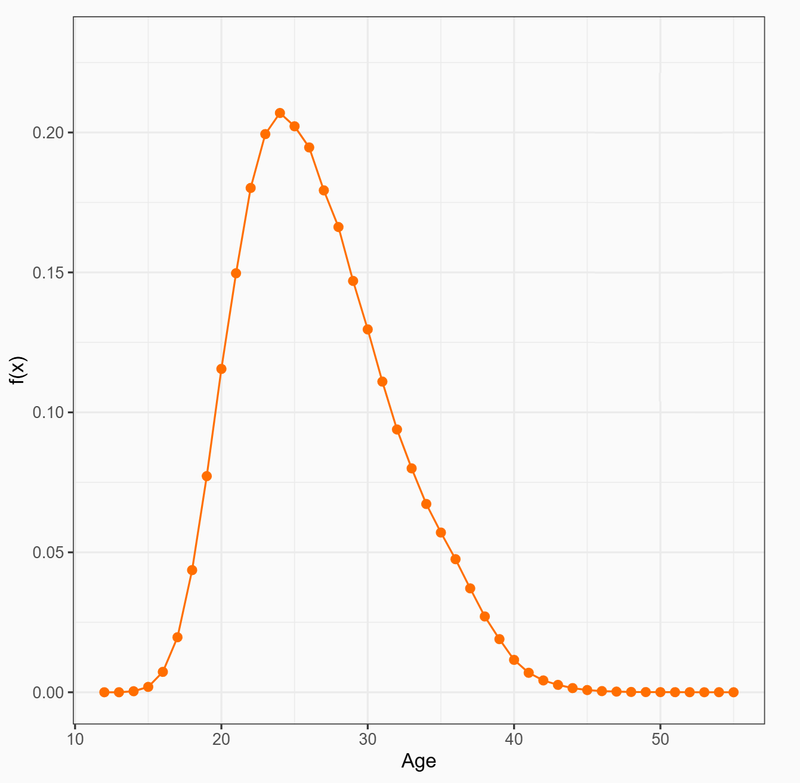

```{css, echo=FALSE}
body {
  font-family: 'Roboto', sans-serif; 
}

h1 {
  color: #005F8D; 
  font-size:  2.2em !important; 
  text-align: center; 
  margin-bottom: 30px !important; 
  text-shadow: 2px 2px 5px rgba(0, 0, 0, 0.3); 
  font-weight: bold; 
}

h2 {
 color: #005F8D; 
  font-size: 2em !important; 
  text-align: center; 
  margin-bottom: 30px !important; 
  text-shadow: 2px 2px 5px rgba(0, 0, 0, 0.3); 
  letter-spacing: 2px; 
  font-weight: bold; 
}

h3 {
  color: #2980B9; 
  font-size: 1.4em;
  font-weight: normal;
}

p {
  font-size: 1em; 
  line-height: 1.3;
  color: #333333; 
}

```

```{r setup, include=F, message=F, warning=F}
knitr::opts_chunk$set(echo = F, message = F, warning = F)
library(dplyr)
library(ggplot2)
library(ggpubr)
library(survey)
library(srvyr)
library(ggstats)
library(kableExtra)
library(tidymodels)
library(vip)
library(DALEX)
library(DALEXtra)
set.seed(1243)
```


# Introducción

Cuando se trabaja con *modelos basados en agentes* en el ámbito demográfico como el modelado de la tasa especifica de fecundidad (ASFR), es usual modelar o hacer cierto supuestos sobre la edad en que las mujeres comienzan a estar en riesgo de concebir.

```{r echo=FALSE, out.width='50%', fig.cap="Ejemplo de tasa especifica de fecundidad (ASFR)", fig.align='center'}

```
---

# Introducción

Es por esto que en este trabajo nos interesa evaluar el desempeño de modelos de aprendizaje supervisado en dos objetivos:  
  
- **Predecir la edad al primer hijo de las mujeres**.  
  
- **Clasificar si una mujer comienza su vida sexual antes o después de los 18 años**.  
  
En ambos casos, se emplearán variables socioeconómicas y comportamentales de las mujeres como predictores. En parte al gran numero de datos disponibles se priorizará el uso de modelos basados en árboles de decisión, como métodos de Bagging o Boosting.

Los datos provienen de las *encuestas DHS* (Programa de Encuestas Demográficas y de Salud), realizadas principalmente en países en desarrollo. Se analizarán las rondas VI y VII, llevadas a cabo entre 2010 y 2020 en varios países.

El programa, gestionado y financiado por la Agencia de los Estados Unidos para el Desarrollo Internacional (USAID), recopila y difunde datos representativos a nivel nacional sobre salud y población.

---

# Descripción de los datos

Se seleccionó un grupo de países representativos de distintas regiones, asegurando un período de tiempo similar y la disponibilidad de variables clave en todas las encuestas. 
  
Se eligieron los siguientes países:  

- América Latina y el Caribe: Perú, Guatemala y República Dominicana.  
- Europa del este: Albania y Armenia.  
- Norte y Sur de África: Etiopía y Sudáfrica.  

El análisis incluye aproximadamente 105.000 observaciones de mujeres entre 15 y 64 años y se centra en 30 variables comunes consideradas relevantes.


---

# Descripción de los datos

```{r preprocesado}
datos_dhs <- read.csv('datos/dhs_6_7.csv') %>%
mutate(v000 = as.factor(case_when(
  v000 == 'AL7' ~ 'Albania',
  v000 == 'AM7' ~ 'Armenia',
  v000 == 'ET7' ~ 'Etiopia',
  v000 == 'GU6' ~ 'Guatemala',
  v000 == 'PE6' ~ 'Perú', 
  v000 == 'DR6' ~ 'República Dominicana', 
  v000 == 'ZA7' ~ 'Sudáfrica')), # País
  # Ponderador
  v005 = as.numeric(v005)/1e6, 
  # Año
  v007 = as.numeric(v007), 
  # Edad
  v012 = as.numeric(v012), 
  # PSU 
  v021 = as.factor(v021),
  # Estrato
  v022 = as.factor(paste0(SurveyId,'_',v022)),
  # Área Urbana/Rural
  v025 = as.factor(ifelse(v025==1,'Urbano','Rural')), 
  # Hogar Electricidad
  v119 = as.factor(case_when(v119==1~'Si', v119==0~'No')),
  # Hogar Televisión
  v121 = as.factor(case_when(v121==1~'Si', v121==0~'No')),
  # Años de Educación
  v133 = as.numeric(case_when(v133 %in% 97:99~NA, T~v133)),
  # Número de personas en el hogar
  v136 = as.numeric(v136),
  # Frecuencia de lectura
  v157 = as.factor(case_when(v157==0~'Nunca',v157%in%c(1,2)~ 'Frecuente',v157==3~'Todos los dias')),
  # Frecuencia de escuchar radio
  v158 = as.factor(case_when(v158==0~'Nunca',v158%in%c(1,2)~ 'Frecuente',v158==3~'Todos los dias')),
  # Frecuencia de ver noticias
  v159 = as.factor(case_when(v159==0~'Nunca',v159%in%c(1,2)~ 'Frecuente',v159==3~'Todos los dias')),
  # Categoría Riqueza
  v190 = as.factor(case_when(v190==1~'Más Pobre', v190==2~'Pobre', v190==3~'Medio', v190==4~'Rico', v190==5~'Más Rico')),
  # Indice de riqueza
  v191 = as.numeric(v191)/1e5,
  # Edad al primer hijo
  v212 = as.numeric(v212),
  # Conocimiento de métodos anticonceptivos
  v301 = as.factor(case_when(v301==0~'Ninguno', v301==1~'Folklórico', v301==2~'Tradicional', v301==3~'Moderno')),
  # Intención de uso de métodos anticonceptivos
  v364 = as.factor(case_when(v364%in%1:2~'Usando Método',
  v364%in%3:4~'No Usando Método',v364==5~'Nunca Tiene Relaciones')),
  # Cantidad de uniones
  v503 = as.factor(case_when(v501%in%c(0,2)~'No casada',v503==1~'Una', v503==2~'Más de Una')),
  # Edad al primer acto sexual
  v531 = as.numeric(case_when(v531 %in% 96:99 ~ NA, T~v531)),
  # Relaciones sexuales recientes
  v536 = as.factor(case_when(v536==0~'Nunca',v536==1~'Activa',
                             v536%in%2:3~'Inactiva')),
  # Numero ideal de hijos
  v613 = as.numeric(case_when(v613 %in% 50:99 ~ NA, T~v613)),
  # Años de educación de la pareja
  v715 = as.numeric(case_when(v715%in%97:99~NA, T~v715)),
  # Ocupación de la mujer
  v717 = as.factor(case_when(v717==0~'No Trabaja', v714==0~'No Trabaja', v717==1~'Profesional/Técnico',v717%in%4:5~'Agricultura',v717%in%c(3,7)~'Servicios/Ventas',v717==6~'Domestico',v717%in%8:9~'Manual')),
  # Numero de parejas sexuales
  v836 = as.numeric(case_when(v836 %in% 96:99 ~ NA, T~v836))) %>% select(-SurveyId,-v501,-v714) 

cod_variables <- names(datos_dhs)

name_variables <-c('id','pais','ponderador','anio','edad','psu','estrato','zona','hogar_elect','hogar_tv','anio_educ','n_fam_hogar','leer','radio','noticias','cat_riqueza','indice_riqueza','edad_phijo','con_antic','uso_antic','cant_uniones','edad_psexo','rec_sexo','nideal_hijos','anio_educ_par','ocupacion','n_parejas')

desc_variables <- c(
  'Identificador de la mujer encuestada',
  'País donde se realizó la encuesta',
  'Peso de la mujer en la encuesta, número entero de 8 dígitos, donde 6 dígitos corresponden a decimales',
  'Año en que se realizó la encuesta',
  'Edad de la mujer encuestada',
  'Unidad primaria de muestreo',
  'Estrato del que se obtuvo la observación',
  'Indica si la mujer es de un área urbana o rural',
  'Indica si el hogar tiene acceso a electricidad',
  'Indica si el hogar dispone de una televisión',
  'Total de años de educación de la mujer, calculado a partir del nivel máximo de educación alcanzado; es un valor comparable entre países',
  'Total de personas que viven en el hogar',
  'Frecuencia con la que la mujer lee un periódico, revista o libro',
  'Frecuencia con la que la mujer escucha la radio',
  'Frecuencia con la que la mujer ve noticias',
  'Categoría de riqueza del hogar',
  'Índice de riqueza del hogar estandarizado, calculado a partir de distintas medidas como materiales de construcción de la casa y servicios disponibles; 5 dígitos corresponden a decimales',
  'Edad de la mujer al primer hijo',
  'Conocimiento de algún método anticonceptivo, donde se distingue entre modernos (ej.: condón, pastillas, parches, etc.), tradicionales (ej.: coito interrumpido, calendario, etc.) y folklóricos (ej.: amuletos, rituales, etc.)',
  'Intención de uso de métodos anticonceptivos',
  'Cantidad de uniones que ha tenido la mujer',
  'Edad de la mujer al primer acto sexual',
  'Relaciones sexuales recientes de la mujer',
  'Número ideal de hijos',
  'Total de años de educación de la pareja de la mujer',
  'Ocupación de la mujer',
  'Cantidad de parejas sexuales que ha tenido la mujer'
)

tipo_variables <- c(
  'Categórica',#id
  'Categórica',#pais
  'Numérica',#ponderador
  'Numérica Discreta',#anio
  'Numérica Discreta',#edad
  'Numérica Discreta',#psu
  'Categórica',#estrato
  'Categórica', #zona
  'Categórica', #hogar_elect
  'Categórica', #hogar_tv
  'Numérica Discreta', #anio_educ
  'Numérica Discreta', #n_fam_hogar
  'Categórica', #leer
  'Categórica', #radio
  'Categórica', #noticias
  'Categórica', #cat_riqueza
  'Numérica', #indice_riqueza
  'Numérica Discreta', #edad_phijo
  'Categórica', #con_antic
  'Categórica', #uso_antic
  'Categórica', #cant_uniones
  'Numérica Discreta', #edad_psexo
  'Categórica', #rec_sexo
  'Numérica Discreta', #nideal_hijos
  'Numérica Discreta' , #anio_educ_par
  'Categórica', #ocupacion
  'Numérica Discreta' #n_parejas
)

rec_variables <- c(paste0(nrow(datos_dhs),' Mujeres'),  paste0(length(levels(datos_dhs$v000)),' Paises'),
                   ' ', paste0(min(datos_dhs$v007),'-',max(datos_dhs$v007)),
                   paste0(min(datos_dhs$v012),'-',max(datos_dhs$v012)),
                   ' ',
                   ' ',
                   '1:Urbano, 2:Rural',
                   '0:No, 1:Si',
                   '0:No, 1:Si',
                   paste0(min(datos_dhs$v133,na.rm = T),'-', max(datos_dhs$v133, na.rm = T)),       paste0(min(datos_dhs$v136),'-',max(datos_dhs$v136)),
                   '0:Nada, 1:Ocasional, 2:Todos los días',
                   '0:Nada, 1:Ocasional, 2:Todos los días',
                   '0:Nada, 1:Ocasional, 2:Todos los días',
                   '1:Más Pobre, 2:Pobre, 3:Medio, 4:Rico, 5:Más Rico',                             paste0(min(datos_dhs$v191,na.rm = T), '-',max(datos_dhs$v191, na.rm = T)),       paste0(min(datos_dhs$v212,na.rm = T), '-', max(datos_dhs$v212, na.rm = T)),       '0: Ninguno, 1:Folklórico, 2:Tradicional, 3:Moderno',
                   '1:Usando Método, 2:No Usando Método, 3:Nunca Tiene Relaciones',
                   '0: No casada, 1: Una unión, 2: Más de una unión',
                   paste0(min(datos_dhs$v531,na.rm = T), '-',max(datos_dhs$v531, na.rm = T)),       '0: Nunca, 1: Activa, 2: No activa',
                   paste0(min(datos_dhs$v613,na.rm = T), '-',max(datos_dhs$v613, na.rm = T)),       paste0(min(datos_dhs$v715,na.rm = T), '-',max(datos_dhs$v715, na.rm = T)),
                   '0: No Trabaja, 1: Profesional/Técnico, 2: Agricultura, 3: Servicios/Ventas, 4: Doméstico, 5: Manual',
                   paste0(min(datos_dhs$v836,na.rm = T),'-',max(datos_dhs$v836,na.rm = T)))
                   
                   
tabla_variables <- data.frame(cod_variables, name_variables,desc_variables,tipo_variables,rec_variables)

names(datos_dhs) <- name_variables 

tabla_variables1 <- tabla_variables[1:15,]
tabla_variables2 <- tabla_variables[16:nrow(tabla_variables),]

kable(tabla_variables1, caption = 'Descripción de las variables disponibles en el trabajo.', col.names = c('Codigo DHS','Nombre','Descripción','Tipo','Recorrido'), align = 'clllc', booktabs = TRUE) %>% 
  kable_styling(latex_options = "striped", font_size = 12, position = "center") %>% column_spec(3, width = '26em') %>%
  column_spec(5, width = '10em') %>% column_spec(c(1,2), width = '4.5em')
```

---

# Descripción de los datos

```{r}
kable(tabla_variables2, caption = 'Descripción de las variables disponibles en el trabajo.', col.names = c('Codigo DHS','Nombre','Descripción','Tipo','Recorrido'), align = 'clllc', booktabs = TRUE, row.names = FALSE) %>% 
  kable_styling(latex_options = "striped", font_size = 10, position = "center") %>% column_spec(3, width = '26em') %>%
  column_spec(5, width = '10em') %>% column_spec(c(1,2), width = '4.5em')
```

---

# Descripción de los datos

Los datos provienen de una muestra compleja con un diseño muestral **estratificado por conglomerados en dos etapas**, representativo a nivel nacional, regional, y urbano-rural.

Aunque este diseño debería incorporarse en los modelos para una mejor representación poblacional, en modelos como Random Forest no existe bibliografía ampliamente desarrollada al respecto. Por ello, en esta primera aproximación **NO** se incorpora explícitamente, aunque sí se considera en el análisis exploratorio para comprender mejor la estructura y distribución de los datos.

A su vez el análisis exploratorio teniendo en cuenta el diseño o no, dio resultados muy similares con lo que la muestra en principio es representativa de la población.

---

# Edad al primer hijo

La edad en que las mujeres comienzan a tener hijos está influenciada por factores sociales, económicos y culturales. La bibliografía destaca elementos fuertemente vinculados a la fecundidad, como la participación laboral femenina, el acceso a la educación, la planificación familiar y el uso de métodos anticonceptivos.

```{r muestra_phijo}
muestra_phijo <- datos_dhs %>% filter(edad_phijo >= 11) %>% na.omit() %>%
              as_survey_design(ids=psu,strata=estrato, weights=ponderador, nest=TRUE)
```

```{r phijo_xpais , fig.align='center',fig.cap="Gráfico violín, distribución de la edad al primer hijo por país.",fig.height=3,dpi=250}

mean_ephijo <- muestra_phijo %>% 
              group_by(pais) %>%
              summarise(edad_phijo = survey_mean(edad_phijo)) %>%
              mutate(pais=forcats::fct_reorder(pais, edad_phijo))

muestra_phijo %>% mutate(pais = factor(pais,levels=levels(mean_ephijo$pais))) %>%
ggsurvey(aes(x = edad_phijo, y = pais, fill=pais))  + geom_violin() +
  theme_minimal() + labs(x = 'Edad al primer hijo', y = 'País') + theme(legend.position = 'none') + scale_fill_viridis_d() 
```


---

# Edad al primer hijo

```{r tabla_mean_phijo}
kable(mean_ephijo %>% mutate(across(c('edad_phijo', 'edad_phijo_se'), ~ round(., 2))) %>% arrange(edad_phijo), caption = 'Media y Desvio Estimados de la Edad al Primer Hijo por país', col.names = c('País','Media Edad','Desvio'), align = 'lcc', booktabs = TRUE) %>% 
  kable_styling(latex_options = "striped", font_size = 15, position = "center") %>% column_spec(1, width = '20em') %>% column_spec(c(2,3), width = '5em')

```

---

# Edad al primer hijo

```{r edu_att , fig.pos='H', fig.align='center', fig.height=4, dpi=250, fig.cap="Gráfico Densidad, edad al primer hijo por Años de Educación de la Madre."}

muestra_phijo %>% filter(anio_educ<22) %>%
  ggsurvey(aes(x = edad_phijo, color = anio_educ, group=anio_educ)) + geom_density(linewidth=0.8) +
  labs(x = "Edad al Primer Hijo",
       y = "Frecuencia") +
  theme_minimal() + scale_color_viridis_c(name = "Años de Educación")
```

---

# Edad al primer hijo

```{r edu_att_xpais , fig.pos='H', fig.align='center', fig.height=4, dpi=250, fig.cap="Gráfico Caja, distribución de la edad al primer hijo por país y si la mujer tiene más de 15 años de educación."}

muestra_phijo %>% mutate(anio_edu_15=as.factor(ifelse(anio_educ>=15,1,0)),pais=case_when(pais=="República Dominicana"~"Rep. Dominicana",T~pais)) %>%
 ggsurvey(aes(x = pais, y=	edad_phijo, fill=anio_edu_15)) + 
  geom_boxplot(color = "grey") + theme_minimal()+ scale_fill_viridis_d(name='Años de educación', labels = c('Menor a 15 años', 'Mayor o igual a 15 años')) + labs(x = 'País', y = 'Edad al Primer Hijo') + theme(legend.position = 'top',axis.text.x = element_text(angle = 45, hjust = 1))
```

---

# Edad al primer hijo

```{r riqueza_xpais , fig.pos='H', fig.align='center', fig.height=4, dpi=250, fig.cap="Gráfico Densidad, distribución de la edad al primer hijo por riqueza del hogar."}

muestra_phijo %>% filter(pais%in%c('Armenia','Albania','Guatemala','Perú','Sudáfrica','República Dominicana')) %>%
  mutate(cat_riqueza = factor(cat_riqueza, levels = c('Más Pobre', 'Pobre', 'Medio', 'Rico', 'Más Rico'), ordered = T)) %>%
  ggsurvey(aes(x = edad_phijo, color = cat_riqueza, group=cat_riqueza)) + geom_density(linewidth=0.5,alpha=.4) + facet_wrap(~pais) +
  labs(x = "Edad al Primer Hijo",
       y = "Frecuencia") +
  theme_minimal() + scale_color_viridis_d(name = "Riqueza del Hogar") + theme(legend.position='top')
```

---

# Primera relación sexual

La edad de inicio de las relaciones sexuales marca el inicio del riesgo de concebir y está estrechamente relacionada con la edad al primer hijo. Factores comportamentales, económicos y educativos relevantes para la edad al primer hijo también influyen en esta variable. En este análisis, se considerará si la mujer inicia su vida sexual antes o después de los 18 años.

```{r muestra_psexo}
muestra_psexo <- datos_dhs %>% filter(edad_psexo >= 9) %>% na.omit() %>%
   mutate(psexo_18 = ifelse(edad_psexo >= 18, 1, 0)) %>%
              as_survey_design(ids=psu,strata=estrato, weights=ponderador, nest=TRUE)
```

```{r psexo_xpais , fig.pos='H', fig.align='center', fig.height=3.5, dpi=200, fig.cap="Gráfico barras, Estimación de la proporción de mujeres que comienzan a tener relaciones sexuales antes de los 18 años por país."}

prop_psexo <- muestra_psexo %>%
              group_by(pais) %>%
              summarise(mayor_18 = survey_mean(psexo_18), menor_18 = 1-survey_mean(psexo_18)) %>% select(pais,mayor_18,menor_18)  %>% pivot_longer(cols = c("mayor_18","menor_18"), 
               names_to = "edad", 
               values_to = "proporcion")
  
prop_psexo %>%
ggplot(aes(x = pais, y = proporcion, fill=edad)) +
  geom_bar(stat = "identity", position = "fill") +
  theme_minimal() + labs(x = 'País', y = '') + scale_fill_viridis_d("Comienzo Relaciones\nSexuales",labels=c("Mayor o igual a 18 años", "Menor a 18 años")) + theme(legend.position = 'top',axis.text.x = element_text(angle = 45, hjust = 1))
```

---

# Primera relación sexual

```{r edu_att_clas, fig.pos='H', fig.align='center', fig.height=4, dpi=250, fig.cap="Gráfico de caja, distribución de años de educación de la mujer por comienzo de relaciones sexuales."}

muestra_psexo %>% 
  ggsurvey(aes(x = as.factor(psexo_18), y = anio_educ,fill=as.factor(psexo_18))) + geom_boxplot(color = "grey") +
  labs(x = "",
       y = "Años de Educación de la Mujer") +
  theme_minimal() + scale_fill_viridis_d(name = "Comienzo Relaciones Sexuales",labels=c("Menor a 18 años","Mayor o igual a 18 años"))
```

---

# Primera relación sexual

```{r psexo_xcat_riqueza , fig.pos='H'}
#| label: fig-psexo_xcat_riqueza
#| fig-cap: "Gráfico barras, Estimación de la proporción de mujeres que comienzan a tener relaciones sexuales antes de los 18 años por categría de riqueza."
#| fig-align: center
#| fig-height: 3.5
#| fig-width: 5

prop_cat_riqueza <- muestra_psexo %>%
    group_by(cat_riqueza) %>%
    summarise(mayor_18 = survey_mean(psexo_18), menor_18 = 1-survey_mean(psexo_18)) %>%
    select(cat_riqueza,mayor_18,menor_18) %>%
    pivot_longer(cols = c("mayor_18","menor_18"),                                                                                     names_to = "edad",                                                                                          values_to = "proporcion") %>% 
    mutate(cat_riqueza = factor(cat_riqueza, levels = c("Más Pobre", "Pobre", "Medio", "Rico", "Más Rico")))

prop_cat_riqueza %>%
    ggplot(aes(x = cat_riqueza, y = proporcion, fill = edad)) +
    geom_bar(stat = "identity", position = "fill") +
    theme_minimal() +
    labs(x = 'Categoría de Riqueza', y = '') +
    scale_fill_viridis_d("Comienzo Relaciones\nSexuales",
                         labels = c("Mayor o igual a 18 años", "Menor a 18 años")) +
    theme(legend.position = 'top', axis.text.x = element_text(angle = 45, hjust = 1))

```

---

# Primera relación sexual

```{r psexo_xtv , fig.pos='H'}
#| label: fig-psexo_xtv
#| fig-cap: "Gráfico barras, Estimación de la proporción de mujeres que comienzan a tener relaciones sexuales antes de los 18 años por si poseen o no un televisor en su hogar."
#| fig-align: center
#| fig-height: 3
#| fig-width: 4.5

prop_hogar_tv <- muestra_psexo %>%
    group_by(hogar_tv) %>%
    summarise(mayor_18 = survey_mean(psexo_18), menor_18 = 1-survey_mean(psexo_18)) %>%
    select(hogar_tv,mayor_18,menor_18) %>%
    pivot_longer(cols = c("mayor_18","menor_18"),                                                                                     names_to = "edad",                                                                                         values_to = "proporcion")

prop_hogar_tv %>%
    ggplot(aes(x = hogar_tv, y = proporcion, fill = edad)) +
    geom_bar(stat = "identity", position = "fill") +
    theme_minimal() +
    labs(x = '¿Hogar con TV?', y = '') +
    scale_fill_viridis_d("Comienzo Relaciones Sexuales",
                         labels = c("Mayor o igual a 18 años", "Menor a 18 años"))
```

---

# Modelado de la edad al primer hijo
## Filtrado de variables

En esta primera aproximación al problema se opta por solamente tomar las observaciones que dispongan de todos los datos necesarios para el modelo, no realizándose imputaciones de datos faltantes o análisis de la no respuesta a la encuesta.

En total se utilizan **46029 observaciones** de mujeres donde se utilizara un 85% de los datos para entrenar y el 15% restante para evaluar los modelos considerados.

En esta división se tendrá en cuenta el país de origen de la mujer para que no haya un desbalance de muchas observaciones de algún país en particular.  

Casos extremos: Ejemplo: Se consideran únicamente las mujeres que tuvieron su primer hijo a partir de los 11 años, límite establecido con base en criterios biológicos.

---

# Modelado de la edad al primer hijo
## Selección   de   covariables   relevantes

Antes de seleccionar las variables para el modelo, se excluyen aquellas que carecen de sentido práctico. Por ejemplo:
- la edad de la mujer
- la edad a la primera relación sexual 

Paso previo: análisis de importancia de las variables. Para esto se utiliza un modelo de *Random Forest* donde se utiliza el método de permutación para calcular la importancia de las variables:
- grilla de 30 combinaciones posibles de la cantidad de variables a considerar en cada nodo (*mtry*)
- cantidad mínima de observaciones en cada nodo terminal (*min_n*)
- *10-fold cross-validation* para evaluar los modelos. Se seleccionó el mejor modelo en base a la métrica de raíz del error cuadrático medio.

---

# Modelado de la edad al primer hijo
## Selección de covariables relevantes

```{r split_phijo}
datos_phijo <- datos_dhs %>% select(-id,-psu,-estrato,-anio,-ponderador,-edad,-edad_psexo) %>%
  filter(edad_phijo >= 11) %>% na.omit() %>%
  initial_split(strata=pais,prop=0.85)

train_phijo <- training(datos_phijo)
test_phijo <- testing(datos_phijo)
```

```{r}
# Carga Modelo RF importancia edad al primer hijo
load('datos/imp_phijo.RData')

imp_phijo <- vip(vip_phijo_fit,num_features=19)
```

```{r vip_phijo , fig.pos='H'}
#| label: fig-vip_phijo
#| fig-cap: "Gráfico barras, importancia de las variables consideradas en el modelo de Random Forest mediante permutación para predecir la edad al primer hijo."
#| fig-align: center
#| fig-height: 3.8
#| fig-width: 6.2

imp_phijo + labs(x = 'Variable', y = 'Importancia') + theme_minimal()
```

---

# Modelado de la edad al primer hijo
## Selección de covariables relevantes

En este caso las variables que quedaron seleccionadas son:

1.  Años de educación de la mujer.
2.  País de procedencia de la mujer.
3.  Índice de riqueza del hogar.
4.  Cantidad de uniones que ha tenido la mujer.
5.  Años de educación de la pareja de la mujer.
6.  Si el hogar dispone de televisión.
7.  Categoría de riqueza del hogar.
8.  Numero de parejas sexuales que ha tenido la mujer.
9.  Numero ideal de hijos.
10. Numero de personas que viven en el hogar.


---

# Modelado de la edad al primer hijo
## Búsqueda de Hiperparámetros
### Bagging

Se procede a la búsqueda de hiperparámetros para los modelos en busca del modelo que presente la mejor *performance*. Para esto se crea una grilla específica para cada uno, evaluando todos los modelos en conjunto mediante *workflow_map*.

Se entrenaron:
- cantidad mínima de observaciones en cada nodo terminal (*min_n*)
- cantidad de árboles (*trees*)

```{r, bagging_grid}
tibble(min_n = c(50,100,150,200,250,300,350,400,450,500,
                                 1000,1500,2000,2500),
       trees = c(50,100,500,1000,"","","","","","","","","","")) %>% t() %>% kable(caption = 'Grilla de hiperparámetros para modelos de Bagging',  booktabs = TRUE) %>% 
  kable_styling(latex_options = "striped", font_size = 8, position = "center")
```


---

# Modelado de la edad al primer hijo
## Búsqueda de Hiperparámetros
### Bagging

```{r tune_phijo}
load('datos/tune_phijo.RData')
```

```{r tune_bagging_phijo , fig.pos='H'}
#| label: fig-tune_bagging_phijo
#| fig-cap: "Gráfico, resultados de la búsqueda de hiperparámetros para modelos de Bagging."
#| fig-align: center
#| fig-height: 4
#| fig-width: 6.4

autoplot(tune_phijo$result[[1]]) + labs(x="Tamaño mínimo de nodo (min_n)") + theme_minimal() + scale_color_viridis_d(name='Cantidad\nde árboles\n(trees)')
```

---

# Modelado de la edad al primer hijo
## Búsqueda de Hiperparámetros
### Random Forest

Se entrenaron:
- cantidad mínima de observaciones en cada nodo terminal (*min_n*)
- cantidad de variables a considerar en cada nodo (*mtry*)
- cantidad de árboles (*trees*)


```{r, rf_grid}
tibble(min_n = c(50,100,150,200,250,300,350,400,450,500,
                                 1000,1500,2000,2500),
       trees = c(50,100,500,1000,"","","","","","","","","",""),
       mtry = c(2,4,6,8,10,"","","","","","","","","")) %>% t() %>% kable(caption = 'Grilla de hiperparámetros para modelos de Random Forest',  booktabs = TRUE) %>% 
  kable_styling(latex_options = "striped", font_size = 8, position = "center")
```

---

# Modelado de la edad al primer hijo
## Búsqueda de Hiperparámetros
### Random Forest

```{r tune_rf_phijo , fig.pos='H'}
#| label: fig-tune_rf_phijo
#| fig-cap: "Gráfico, resultados de la búsqueda de hiperparámetros para modelos de Random Forest."
#| fig-align: center
#| fig-height: 4
#| fig-width: 6.4

autoplot(tune_phijo$result[[2]]) + labs(x="Tamaño mínimo de nodo (min_n)")  + theme_minimal() + scale_color_viridis_d(name='Cantidad de predictores (mtry)') + theme(legend.position = 'top', axis.text.x = element_text(angle = 45, hjust = 1))
```

---

# Modelado de la edad al primer hijo
## Búsqueda de Hiperparámetros
### XGBoost

No se definió una grilla fija, se utilizó el método de búsqueda *Latin hypercube sampling*:
- evalúa un espacio de hiperparámetros de forma más eficiente
- se evaluaron un total de 60 combinaciones posibles de hiperparámetros

```{r xgb_grid}
tibble(tree_depth=c(1,15),
       min_n=c("50","500"),
       loss_reduction=c("1e-10",31),
       sample_size=c(0.1,1),
       mtry=c(1,10),
       learn_rate=c(0.0016, 0.16)) %>% t() %>% kable(caption = 'Grilla rango hiperparámetros para modelos de XGBoost',  booktabs = TRUE,col.names = c("","Valor min.","Valor max.")) %>% 
  kable_styling(latex_options = "striped", font_size = 8, position = "center")
```


---

# Modelado de la edad al primer hijo
## Búsqueda de Hiperparámetros
### Resultados
La búsqueda se realiza al igual que para el modelo de visualización de importancias mediante *10-fold cross-validation*. En las figuras se puede visualizar los valores de *RMSE* y *RSQ* para los modelos de *Bagging* y *Random Forest* respectivamente. En ambos gráficos parece bastante marcado una mejor *performance* para valores de *min_n* cercano a los $400$, pareciendo la grilla propuesta adecuada para este problema.

---

# Modelado de la edad al primer hijo
## Comparación de modelos

```{r comp_modelos_phijo , fig.pos='H'}
#| label: fig-comp_modelos_phijo
#| fig-cap: "Gráfico comparación de los modelos de Bagging, Random Forest y XGBoost para predecir la edad al primer hijo."
#| fig-align: center
#| fig-height: 3
#| fig-width: 4

tune_phijo %>% 
   mutate(wflow_id = c("Bagging", "Random Forest", "XGBoost")) %>%
autoplot(
   rank_metric = "rmse",  
   metric = "rmse",       
   select_best = TRUE,
) + theme_minimal() +
   geom_text(aes(y = mean - 0.11, label = wflow_id),size=3, angle = 90) + lims(y=c(3.4,3.7)) +
   theme(legend.position = "none") 
```

---

# Modelado de la edad al primer hijo
## Comparación de modelos

Metrica comparación:
$RMSE = \sqrt{\frac{1}{n} \sum_{i=1}^{n} (y_i - \hat{y}_i)^2}$

- El modelo ajustado por el método de **Random Forest** es el que tiene un valor más bajo del RMSE
- Los tres valores son muy cercanos entre sí, por lo cual sugiere que el rendimiento de los modelos es muy similar. - Esto se puede deber a que los tres son basados en árboles, entonces, por más que haya diferencias en la metodología, a grandes rasgos deberían predecir de forma similar.

---

# Modelado de la edad al primer hijo
## Evaluación modelo final
### Análisis de los Residuos - Conjunto de Entrenamiento

Modelo Final: **Random Forest**

```{r eval_rf_ephijo}
best_phijo <- tune_phijo  %>% 
   extract_workflow_set_result("basic_rec_rf") %>% 
   select_best(metric = "rmse")

# Añadimos que calcule la importancia 
fit_phijo <- tune_phijo %>% 
   extract_workflow("basic_rec_rf") %>% update_model(
  rand_forest(mtry =.cols(), min_n=tune(),  trees=tune()) %>%
  set_engine('ranger',importance='permutation',num.threads=6) %>% set_mode('regression')
  ) %>%
   finalize_workflow(best_phijo) %>% 
   fit(data = train_phijo)

fit_train_phijo <- augment(fit_phijo,new_data=train_phijo) %>% mutate(residuos = .pred - edad_phijo)

fit_test_phijo <- augment(fit_phijo,new_data=test_phijo)
```

```{r res_modelo_phijo , fig.pos='H'}
#| label: fig-res_modelo_phijo
#| fig-cap: "Gráfico residuos vs predichos, conjunto de entrenamiento."
#| fig-align: center
#| fig-height: 4
#| fig-width: 6.4

fit_train_phijo %>% ggplot(aes(x = .pred, y = residuos,color=pais)) +
  geom_point(alpha = 0.3) + geom_hline(yintercept = 0, color = "red") +
  labs(x = "Predicción", y = "Residuos") +
  theme_minimal()
```

---

# Modelado de la edad al primer hijo
## Evaluación modelo final
### Análisis de los Residuos - Conjunto de Entrenamiento

- Puntos simétricos alrededor del cero (No habría sesgo)
- No se observa un patrón en la nube de puntos (El modelo habría ajustado correctamente)
- Aparición de algunos valores atípicos de los residuos en la parte negativa del gráfico (el modelo no logra estimar bien la edad a la que las mujeres realmente tuvieron su primer hijo para valores más altos)
- Los puntos segmentados por país presentan aproximadamente el mismo comportamiento 

---

# Modelado de la edad al primer hijo
## Evaluación modelo final - Conjunto de Testeo

```{r eval_modelo_phijo , fig.pos='H'}
#| label: fig-eval_modelo_phijo
#| fig-cap: "Gráfico predicho vs observado, conjunto de testeo."
#| fig-align: center
#| fig-height: 4
#| fig-width: 6.4

fit_test_phijo %>% ggplot(aes(x = .pred, y = edad_phijo)) +
  geom_point(alpha = 0.5) +
  geom_abline(intercept = 0, slope = 1, color = "red") +
  labs(x = "Predicción", y = "Observado") +
  theme_minimal()
```

Se observa el mismo comportamiento que en el conjunto de entrenamiento (No habría sobreajuste)

---

# Modelado de la edad al primer hijo
## Evaluación modelo final

- El *RMSE* del modelo para cada país es muy similar al resto
- $MAPE = \frac{1}{n} \sum_{i=1}^{n} \left| \frac{y_i - \hat{y}_i}{y_i} \right| \times 100$
- Indica la media del error porcentual de todas las observaciones de cada país
- Muy parecida para todos los países, y no indican que ningún país prediga muy mal la variable a explicar

```{r}
metricas_reg <- metric_set(rmse,mape)
fit_test_phijo %>% group_by(pais) %>% metricas_reg(truth = edad_phijo, estimate = .pred) %>%
  pivot_wider(names_from = .metric, values_from = .estimate) %>% select(pais,rmse,mape) %>% 
  mutate(across(is.numeric, ~round(.,2))) %>%
  kable(caption = 'Métricas en el conjunto de testeo',  booktabs = TRUE) %>% 
  kable_styling(latex_options = "striped", font_size = 8, position = "center")
```

---

# Modelado de la edad al primer hijo
## Interpretación e importancia de las variables

Resultados muy similares a los obtenidos en el anterior ejemplo y el análisis exploratorio, siendo las variables años de educación y país de la mujer las variables con más importancia.

```{r vip_fit_phijo , fig.pos='H'}
#| label: fig-vip_fit_phijo
#| fig-cap: "Gráfico barras, importancia de las variables consideradas en el modelo final."
#| fig-align: center
#| fig-height: 4
#| fig-width: 6.4

vip(fit_phijo) + labs(x = 'Variable', y = 'Importancia') + theme_minimal()
```

```{r}
explainer_fit_phijo <- explain_tidymodels(
    model= fit_phijo,
    data = train_phijo,
    y = train_phijo$edad_phijo,
    label = "Modelo edad al primer hijo",
    verbose = FALSE
  )
```

```{r warning=FALSE}
pdp_educ <- model_profile(explainer_fit_phijo, N = 1000, variables = "anio_educ")

pdp_pais <- model_profile(explainer_fit_phijo, N = 1000, variables = "pais")
```

---

# Modelado de la edad al primer hijo
## Interpretación e importancia de las variables
### Gráfico de Dependencia Parcial - Años de educación

```{r pdp_educ , fig.pos='H'}
#| label: fig-pdp_educ
#| fig-cap: "Gráfico PDP, efecto de los años de educación en la edad al primer hijo."
#| fig-align: center
#| fig-height: 4
#| fig-width: 6.4

plot(pdp_educ) + geom_rug() + theme_minimal() + labs(title='',subtitle='',x='Años de Educación', y='Edad Media al Primer Hijo')
```

---

# Modelado de la edad al primer hijo
## Interpretación e importancia de las variables
### Gráfico de Dependencia Parcial - Años de educación

- Efecto marginal que tiene la variable de años de educación de la madre con respecto a la variable de interés del problema planteado.
- La edad media de la mujer a la hora de tener su primer hijo en mujeres que tienen 10 o menos años de educación permanece constante entre los 19 y 20 años
- Luego de los 10 años de educación, la edad media de la mujer al tener su primer hijo crece de forma abrupta por cada año extra de educación que tiene la mujer.

---

# Modelado de la edad al primer hijo
## Interpretación e importancia de las variables
### Gráfico de Dependencia Parcial - País

```{r pdp_pais , fig.pos='H'}
#| label: fig-pdp_pais
#| fig-cap: "Gráfico PDP, efecto del país en la edad al primer hijo."
#| fig-align: center
#| fig-height: 3.8
#| fig-width: 6.4

plot(pdp_pais)  + theme_minimal() + labs(title='',subtitle='',x='País', y='Edad Media al Primer Hijo') + theme(axis.text.x = element_text(angle = 45, hjust = 1)) + lims(y=c(0,25))
```
---

# Modelado de la edad al primer hijo
## Interpretación e importancia de las variables
### Gráfico de Dependencia Parcial - País

- Efecto marginal de la variable de país sobre la variable de interés.
- Similar al análisis exploratorio: países europeos tienen la edad media de la mujer al tener su primer hijo un poco más alta que el resto.

---

# Modelado de la edad a la primera relación sexual

- Modelado de la edad a la primera relación sexual. Interesa predecir la proporción de mujeres que comienzan a tener relaciones sexuales antes de los 18 años en algunos países.
- Se creó otra variable que combine el país y la variable de interés, para que en el proceso de división de los datos o el remuestreo no haya un desbalance.
- Se trabajó con observaciones que disponen de todos los datos necesarios para el modelo
- Se construyó la variable de interés a partir de la variable *edad_psexo*
- Se filtraron observaciones con valores extremadamente atípicos o que podrían carecer de sentido, en este caso se toma como límite inferior de la edad a la primera relación sexual los 9 años
- **49349 observaciones** donde nuevamente se utilizará un 85% de los datos para entrenar y el 15% restante para evaluar los modelos considerados.

---

# Modelado de la edad a la primera relación sexual
## Selección de covariables relevantes

```{r split_psexo}
datos_psexo <- datos_dhs %>% select(-id,-psu,-estrato,-anio,-ponderador,-edad,-edad_phijo) %>%
   filter(edad_psexo >= 9) %>% na.omit() %>%
   mutate(psexo_18 = as.factor(ifelse(edad_psexo >= 18, 1, 0))) %>%
  mutate(pais_psexo_18 = as.factor(paste(pais,psexo_18,sep='_'))) %>%
  select(-edad_psexo) %>%
  initial_split(strata=pais_psexo_18,prop=0.85)

train_psexo <- training(datos_psexo)
test_psexo <- testing(datos_psexo)
```

```{r}
# Carga Modelo RF importancia edad a la primera relacion sexual
load('datos/imp_psexo.RData')

imp_psexo <- vip(vip_psexo_fit,num_features=19)
```

Nuevamente al igual que en el caso anterior existen potencialmente variables irrelevantes para el problema, con lo cual se decide realizar nuevamente un modelo de *Random Forest* y visualizar la importancia de las variables. El procedimiento utilizado es el mismo que en el caso anterior, donde se prueba una grilla de 30 combinaciones para *mtry* y *min_n*, seleccionando el mejor modelo en este caso al estar trabajado en un problema de clasificación se utiliza como métrica el área bajo la curva *ROC* (*roc_auc*).

---

# Modelado de la edad a la primera relación sexual
## Selección de covariables relevantes

En la siguiente figura se observa la importancia de las variables consideradas en el modelo seleccionado. Al igual que en la del anterior ejemplo, variables relacionadas con la educación o riqueza del hogar tienden a tener mayor importancia. De todas formas existen algunas diferencias sobre todo en el orden de importancia, aquí vemos que la cantidad de parejas de la mujer parecería incidir más en la edad a la que comienzan a tener relaciones sexuales. Además cabe destacar el aumento de importancia en este caso de la frecuencia con la que la mujer ve noticias, ésta información suele ser de interés en este tipo de estudios.

---

# Modelado de la edad a la primera relación sexual
## Selección de covariables relevantes

```{r vip_psexo , fig.pos='H'}
#| label: fig-vip_psexo
#| fig-cap: "Gráfico barras, importancia de las variables consideradas en el modelo de Random Forest mediante permutación para predecir si comienza a tener relaciones luego de los 18 años."
#| fig-align: center
#| fig-height: 4
#| fig-width: 6.4

imp_psexo + labs(x = 'Variable', y = 'Importancia') + theme_minimal()
```

---

# Modelado de la edad a la primera relación sexual
## Selección de covariables relevantes

Una vez visualizados los datos y las posibles relaciones entre las variables se procede a armar los modelos. De lo visto, mediante el modelo de *Random Forest*, se seleccionan las *10* variables que más importancia presentaron para clasificar si una mujer comienza su vida sexual antes o después de los 18 años.

En este caso las variables que quedaron seleccionadas son:

1.  Años de educación de la mujer.
2.  País de procedencia de la mujer.
3.  Índice de riqueza del hogar.
4.  Numero de parejas sexuales que ha tenido la mujer.
5.  Años de educación de la pareja de la mujer.
6.  Cantidad de uniones que ha tenido la mujer.
7.  Si el hogar dispone de televisión.
8.  Categoría de riqueza del hogar.
9.  La frecuencia con la que la mujer ve las noticias.
10. Si el hogar tiene acceso a electricidad.

En esta ocasión se propone el uso de modelos basados en árboles: *Bagging* y *Random Forest*. Además, se ajusto un modelo de regresión logística para evaluar si los resultados obtenidos por métodos de árboles o un método mas clásico como la logística difieren en su *performance* en este problema.

---

# Modelado de la edad a la primera relación sexual
## Búsqueda de Hiperparámetros

En este caso se ajustan los hiperparámetros de manera similar a lo realizado en el caso anterior, se ajustan en el caso de *Bagging* la cantidad de árboles y el tamaño mínimo de nodo, mientras que en el caso de *Random Forest* se ajustan la cantidad de variables a considerar en cada nodo (*mtry*), la cantidad mínima de observaciones en cada nodo terminal (*min_n*) y la cantidad de árboles (*trees*). En el caso de la regresión logística no requiere ajustes, ni hiperparámetros aunque si se visualizó la significancia de las covariables del modelo.

Las grillas utilizadas para ambos modelos son las mismas que se utilizaron para la edad al primer hijo, observándose si la misma es adecuada para este problema. En las siguientes figuras se pueden observar los resultados de la búsqueda de hiperparámetros para los modelos de *Bagging* y *Random Forest* respectivamente. Donde se presentan las metricas de *accuracy*, *Brier Score* y área bajo la curva *ROC*.

---

# Modelado de la edad a la primera relación sexual
## Búsqueda de Hiperparámetros

```{r tune_psexo}
load('datos/tune_psexo.RData')
```

```{r tune_bagging_psexo , fig.pos='H'}
#| label: fig-tune_bagging_psexo
#| fig-cap: "Gráfico, resultados de la búsqueda de hiperparámetros para modelos de Bagging."
#| fig-align: center
#| fig-height: 4
#| fig-width: 6.4

autoplot(tune_psexo$result[[2]]) + labs(x="Tamaño mínimo de nodo (min_n)") + theme_minimal() + scale_color_viridis_d(name='Cantidad\nde árboles\n(trees)')
```

---

# Modelado de la edad a la primera relación sexual
## Búsqueda de Hiperparámetros

```{r tune_rf_psexo , fig.pos='H'}
#| label: fig-tune_rf_psexo
#| fig-cap: "Gráfico, resultados de la búsqueda de hiperparámetros para modelos de Random Forest."
#| fig-align: center
#| fig-height: 4
#| fig-width: 6.4

autoplot(tune_psexo$result[[3]]) + labs(x="Tamaño mínimo de nodo (min_n)")  + theme_minimal() + scale_color_viridis_d(name='Cantidad de predictores (mtry)') + theme(legend.position = 'top')
```

---

# Modelado de la edad a la primera relación sexual
## Comparación de modelos

En este caso en la @fig-comp_modelos_psexo se observa la comparación de los modelos de *Bagging*, *Random Forest* y *Regresión Logística* mediante la métrica de área bajo la curva *ROC*. En este caso el modelo de *Random Forest* es el que presenta un mejor desempeño, aunque al igual que en el primer problema los modelos de *Bagging* difieren muy poco en su *performance*. La regresión logística presenta un desempeño inferior algo esperable dada la gran cantidad de datos y variables aunque presenta un desempeño aceptable.

```{r}
tune_psexo <- tune_psexo %>% 
   mutate(wflow_id = c("Logistico", "Bagging", "Random Forest")) 
```

```{r comp_modelos_psexo , fig.pos='H'}
#| label: fig-comp_modelos_psexo
#| fig-cap: "Gráfico comparación de los modelos de Bagging, Random Forest y Regresión Logística, mediante validación cruzada."
#| fig-align: center
#| fig-height: 4
#| fig-width: 6.4

tune_psexo %>%
autoplot(
   rank_metric = "roc_auc",  
   metric = "roc_auc",       
   select_best = TRUE,
) + theme_minimal() +
   geom_text(aes(y = mean - 0.015, label = wflow_id),size=5, angle = 90) + lims(y=c(0.73,0.78)) + labs(x='Ranking',y='Área bajo la curva ROC') +
   theme(legend.position = "none") 
```

---

# Modelado de la edad a la primera relación sexual
## Comparación de modelos

```{r}
best_roc <- tune_psexo$wflow_id %>%
  purrr::map(function(id) {     
  result <- extract_workflow_set_result(tune_psexo, id = id)
  best_params <- select_best(result, metric="roc_auc")
  wflow <- extract_workflow(tune_psexo, id = id)
  best_wf <- finalize_workflow(wflow, best_params)
  fit <- fit(best_wf, data = train_psexo)
  augment(fit, new_data = test_psexo) %>%
    roc_curve(truth = psexo_18,.pred_1, event_level = "second") %>%
    mutate(modelo = id)
  })
```

Tambien podemos visualizar los rendimientos de los modelos mediante las curvas *ROC* en la @fig-comp_roc_psexo. En este caso tambien se observa como los modelos de *RF* y *Bagging* presentan una *performance* algo superior a la regresión logística.

```{r comp_roc_psexo , fig.pos='H'}
#| label: fig-comp_roc_psexo
#| fig-cap: "Gráfico, comparación curvas ROC para los modelos considerados en el conjunto de testeo"
#| fig-align: center
#| fig-height: 4
#| fig-width: 6.4

autoplot(bind_rows(best_roc)) + aes(color = modelo) + labs(x='1 - Especificidad', y='Sensibilidad') + theme_minimal() + scale_color_discrete(name='Modelo')
```

---

# Modelado de la edad a la primera relación sexual
## Evalación modelo final

```{r eval_rf_epsexo}
best_psexo <- tune_psexo  %>% 
   extract_workflow_set_result("Random Forest") %>% 
   select_best(metric = "roc_auc")

# Añadimos que calcule la importancia 
fit_psexo <- tune_psexo %>% 
   extract_workflow("Random Forest") %>% update_model(
  rand_forest(mtry =.cols(), min_n=tune(),  trees=tune()) %>%
  set_engine('ranger',importance='permutation',num.threads=6) %>% set_mode('classification')
  ) %>%
   finalize_workflow(best_psexo) %>% 
   fit(data = train_psexo)

fit_test_psexo <- augment(fit_psexo,new_data=test_psexo)
```

En la siguiente figura se observa la matriz de confusión para el modelo de *Random Forest* en el conjunto de testeo. En este caso el rendimiento del modelo parece aceptable, donde está ciertamente balanceado en la cantidad de falsos positivos y falsos negativos. Aunque el mismo presenta un desempeño algo inferior en clasificar mujeres que comienzan su vida sexual antes de los 18 años.

```{r conf_mat , fig.pos='H'}
#| label: fig-conf_mat
#| fig-cap: "Matriz de confusión para el modelo de Random Forest en el conjunto de testeo."
#| fig-align: center
#| fig-height: 4
#| fig-width: 6.4

fit_test_psexo %>% 
  conf_mat(truth = psexo_18, estimate = .pred_class) %>% autoplot(type = "heatmap") +
  scale_fill_gradient(low="#D6EAF8",high = "#2E86C1") + theme_minimal() +  theme(legend.position = 'none') +
  scale_x_discrete(name='Observado',labels = c('< 18','>= 18')) + scale_y_discrete(name='Predicho',labels = c('>= 18','< 18'))
```

---

# Modelado de la edad a la primera relación sexual
## Evalación modelo final

A partir de la misma es posible calcular las métricas para evaluar el rendimiento del modelo, se puede observar en la siguiente tabla las métricas más importantes. En este caso la precisión del modelo supera por encima del 70% lo cual es un valor aceptable considerando el problema planteado. En cuanto a la sensibilidad y especificidad del modelo se observa que la especificidad es algo inferior a la sensibilidad, al igual que lo observado en la matriz de confusion el modelo tiene mayor dificultad en clasificar correctamente las mujeres que comienzan a tener relaciones sexuales antes de los 18 años.

```{r}
metricas <- metric_set(accuracy,sensitivity,specificity)

tabla_met <- metricas(data= fit_test_psexo, truth = psexo_18,estimate=.pred_class) %>%
 select(Metrica=.metric,Valor=.estimate) %>% 
  mutate(across(is.numeric, ~round(.,2))) 
tabla_met$Metrica <- c('Accuracy','Sensibilidad','Especificidad')

tabla_met %>%
  kable(caption = 'Métricas en el conjunto de testeo',  booktabs = TRUE) %>% 
  kable_styling(latex_options = "striped", font_size = 8, position = "center")
```

---

# Modelado de la edad a la primera relación sexual
## Interpretación de las variables

Al igual que el caso de la edad al primer hijo se procede a visualizar la interpretación de las variables en el modelo mediante los gráficos de dependencia parcial.

```{r}
explainer_psexo <-
  explain_tidymodels(
    model= fit_psexo,
    data = train_psexo,
    y = train_psexo$psexo_18,
    label = "fit_psexo",
    verbose = FALSE
  )
```

```{r}
pdp_educ_psexo <- model_profile(explainer_psexo, N = 1000, variables = "anio_educ")
```

Se observa en la siguiente figura que el efecto de los años de educación de la mujer en la probabilidad de comenzar a tener relaciones sexuales luego de los 18 años. Se observa que la probabilidad de comenzar a tener relaciones sexuales luego de los 18 años aumenta de forma abrupta a partir de los 10 años de educación el efecto es similar al observado en el caso de la edad al primer hijo.

```{r pdp_educ_psexo , fig.pos='H'}
#| label: fig-pdp_educ_psexo
#| fig-cap: "Gráfico PDP, efecto de los años de educación en la probabilidad de comenzar a tener relaciones sexuales luego de los 18 años."
#| fig-align: center
#| fig-height: 4
#| fig-width: 6.4

plot(pdp_educ_psexo) + geom_rug() + theme_minimal() + labs(title='',subtitle='',x='Años de Educación', y='Prob. relaciones > 18 años')
```

---

# Modelado de la edad a la primera relación sexual
## Interpretación de las variables

En cuanto al índice de riqueza el efecto parece menos marcado que en el caso anterior, en la siguiente figura se observa que la probabilidad de comenzar a tener relaciones sexuales luego de los 18 años incrementa pero de forma irregular al aumentar el indice de riqueza del hogar.

```{r}
pdp_riq_psexo <- model_profile(explainer_psexo, N = 1000, variables = "indice_riqueza")
```

```{r pdp_ind_riq_psexo , fig.pos='H'}
#| label: fig-pdp_riq_psexo
#| fig-cap: "Gráfico PDP, efecto del indice de riqueza en el hogar en la probabilidad de comenzar a tener relaciones sexuales luego de los 18 años."
#| fig-align: center
#| fig-height: 4
#| fig-width: 6.4

plot(pdp_riq_psexo) + geom_rug() + theme_minimal() + labs(title='',subtitle='',x='Indice de Riqueza', y='Prob. relaciones > 18 años') + xlim(c(-2,3))
```

---

# Modelado de la edad a la primera relación sexual
## Interpretación de las variables

En cuanto al país de residencia de la mujer, al igual que como se observó en el análisis exploratorio, es esperable que países como Albania o Armenia presenten una mayor probabilidad de comenzar a tener relaciones sexuales luego de los 18 años. En la siguiente figura se observa algo razonable con lo visto donde Armenia y Albania están por encima del resto de los países.

```{r}
pdp_pais_psexo <- model_profile(explainer_psexo, N = 1000, variables = "pais")
```

```{r pdp_pais_psexo , fig.pos='H'}
#| label: fig-pdp_pais_psexo
#| fig-cap: "Gráfico PDP, efecto del pais de la mujer en la probabilidad de comenzar a tener relaciones sexuales luego de los 18 años."
#| fig-align: center
#| fig-height: 4
#| fig-width: 6.4

plot(pdp_pais_psexo) + theme_minimal() + labs(title='',subtitle='',x='País', y='Prob. relaciones > 18 años') + theme(axis.text.x = element_text(angle = 45, hjust = 1)) 
```

---

# Comentarios Finales

Como se observo el resultado general de los modelos fue aceptable en ambos casos, teniendo en cuenta que las variables de interés son de naturaleza compleja y el error irreducible en este tipo de caso es elevado. En cuanto las mejoras posibles se debería considerar formas de mejorar la predicción en el caso de edad del primer hijo para mujeres de mayores edades algo que no se ha conseguido captar en este caso, algo que posiblemente se deba a que no se tengan covariables óptimas para captar este fenómeno.

